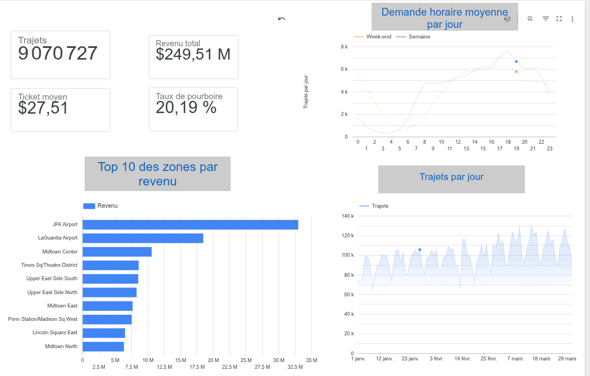

# NYC Taxi Analytics — Pipeline Big Data vers BigQuery

[](https://github.com/younesbou1608/nyc-taxi-pipeline/actions/workflows/ci.yml)

Pipeline de données de bout en bout sur les trajets de taxis jaunes de New York
(NYC TLC, ~3 M de lignes par mois) : ingestion, nettoyage distribué avec **PySpark**,
chargement dans **BigQuery**, modélisation dimensionnelle et tests de qualité avec **dbt**,
orchestration **Airflow** et CI **GitHub Actions**.

**📊 [Voir le dashboard en ligne](https://datastudio.google.com/reporting/ea417265-5ab1-41f5-a8e6-ff03cd52ff0c)**
(Data Studio, T1 2024, 9 070 727 trajets)



**100 % gratuit** : tourne sur le [sandbox BigQuery](https://cloud.google.com/bigquery/docs/sandbox),
sans carte bancaire. Ce choix impose des contraintes fortes, qui ont façonné l'architecture
(voir [Contraintes du sandbox et choix de design](#contraintes-du-sandbox-et-choix-de-design)).

---

## Architecture

```
                 ┌──────────────────────────┐
                 │  NYC TLC (Parquet CDN)   │
                 └────────────┬─────────────┘
                              │  src/download.py   (téléchargement atomique)
                              ▼
                 ┌──────────────────────────┐
                 │  data/raw/*.parquet      │   + référentiel des 265 zones
                 └────────────┬─────────────┘
                              │  src/transform.py  (PySpark)
                              │  · typage, règles qualité, colonnes dérivées
                              │  · broadcast join sur les zones
                              ▼
                 ┌──────────────────────────┐
                 │  data/clean/trips/       │   partitionné year=/month=
                 │  data/clean/_quality/    │   rapport de rejet (JSON)
                 └────────────┬─────────────┘
                              │  src/load_bq.py
                              │  WRITE_TRUNCATE sur trips_clean$YYYYMM
                              │  + vérification du nombre de lignes
                              ▼
        ┌────────────────────────────────────────────┐
        │  BigQuery · nyc_taxi_raw                   │
        │  trips_clean  (partition entière year_month│
        │                cluster zone, paiement)     │
        └────────────────────┬───────────────────────┘
                             │  dbt build   (tables, pas de DML)
                             ▼
        ┌────────────────────────────────────────────┐
        │  BigQuery · nyc_taxi_analytics             │
        │  staging : stg_trips, stg_zones            │
        │  marts   : fct_trips, dim_zone, dim_date   │
        │            agg_daily_zone, agg_hourly_…    │
        └────────────────────┬───────────────────────┘
                             ▼
                  Data Studio (dashboard) / SQL ad hoc

Orchestration : Airflow (DAG mensuel)  ·  CI : ruff + pytest + dbt parse
```

### Modèle en étoile

| Table | Grain | Rôle |
|---|---|---|
| `fct_trips` | 1 trajet | Faits : distance, durée, montants, pourboire |
| `dim_zone` | 1 zone TLC (265) | Quartier, nom de zone, service zone |
| `dim_date` | 1 jour | Année, mois, jour de semaine, week-end |
| `agg_daily_zone` | jour × zone | Volume et revenus par zone |
| `agg_hourly_demand` | heure × week-end | Profil de demande horaire |

---

## Contraintes du sandbox et choix de design

Le premier design (partition par date, `DELETE` puis `APPEND`, modèle dbt incrémental en
`merge`) **échouait silencieusement** : le chargement se terminait sans erreur, mais la table
contenait **0 ligne**. Un script de validation ([`scripts/poc_sandbox.py`](scripts/poc_sandbox.py))
a isolé les causes :

| Contrainte du sandbox | Effet sur le design initial | Réponse |
|---|---|---|
| Partitions temporelles expirées après 60 jours | Données 2024 partitionnées par `pickup_date` supprimées dès le chargement | **Partitionnement par entier** sur `year_month` (202401…), non soumis à l'expiration |
| Pas de DML (`DELETE`, `MERGE`) | Purge du mois et `merge` dbt impossibles | Chargement en **`WRITE_TRUNCATE` sur la partition** (`trips_clean$202401`) ; dbt en **`table`** (`CREATE OR REPLACE`, qui est du DDL) |
| Tables expirées après 60 jours | L'entrepôt disparaît périodiquement | Pipeline **reconstructible en une commande** : `make rebuild` |
| Pas de Cloud Storage | Pas de data lake GCS | Parquet local chargé directement ; GCS documenté comme évolution |

Garde-fou ajouté : après chaque chargement, `load_bq.py` compare le nombre de lignes produites
par Spark, chargées, et présentes en base. Le moindre écart fait échouer la tâche, de sorte
que l'échec silencieux initial ne peut plus se reproduire.

**Réconciliation de bout en bout** sur T1 2024 : 9 070 727 lignes en sortie de Spark,
9 070 727 chargées dans BigQuery, 9 070 727 dans `fct_trips`, 9 070 727 affichées par le
dashboard. Aucune ligne perdue ni dupliquée entre la source et la visualisation.

**Idempotence** : recharger un mois remplace exactement sa partition (vérifié : rejouer
janvier ne crée aucun doublon, corriger janvier ne touche pas février). Côté dbt, reconstruire
une table depuis la source est idempotent par construction.

---

## Prérequis

- Python 3.11
- **Java 17** (requis par PySpark) : `java -version`
- Un projet Google Cloud avec le **sandbox BigQuery** (sans carte bancaire)
- `gcloud` CLI pour l'authentification locale

---

## Installation

```bash
git clone <votre-repo> && cd nyc-taxi-pipeline
make setup && source .venv/bin/activate
cp .env.example .env              # renseigner GCP_PROJECT_ID
set -a && source .env && set +a

gcloud auth application-default login
gcloud auth application-default set-quota-project $GCP_PROJECT_ID

make poc                          # vérifie que le projet GCP accepte ce design
```

---

## Exécution

```bash
# Un mois, étape par étape
make download  YEAR=2024 MONTH=1
make transform YEAR=2024 MONTH=1
make load      YEAR=2024 MONTH=1   # rejouable sans doublon
make dbt-build

# Un mois de bout en bout
make pipeline YEAR=2024 MONTH=1

# Reconstruire tout l'entrepôt (après expiration des 60 jours, ou from scratch)
make rebuild YEAR=2024 MONTHS="1 2 3"
```

Pendant le développement, limiter la volumétrie :

```bash
python -m src.transform --year 2024 --month 1 --sample 100000
```

---

## Orchestration Airflow

```bash
docker compose up -d      # http://localhost:8080
```

Le DAG `nyc_taxi_pipeline` s'exécute le 5 de chaque mois et traite le mois M-2
(délai de publication de la TLC) :

```
resolve_period → download → spark_transform → load_bigquery → dbt_build
```

---

## Qualité des données

**1. En amont, dans Spark** (`src/config.py` → `QualityRules`) : les lignes invalides sont
écartées et un rapport JSON est écrit dans `data/clean/_quality/`. Un taux de rejet supérieur
à 25 % déclenche un avertissement.

Règles : durée entre 1 et 360 minutes, distance entre 0,1 et 200 miles, montant total entre
0,01 et 5 000 $, 1 à 8 passagers, date dans le mois traité, zones non nulles.

**2. Au chargement** : le nombre de lignes en base doit égaler la sortie Spark.

**3. En aval, dans dbt** : tests `not_null`, `unique`, `relationships`, `accepted_values`,
`accepted_range`, unicité de combinaisons, plus deux tests métier (pas de revenu négatif,
pourboire inférieur au total). L'unicité de `trip_key` est en *warning* et non en erreur : la
source TLC n'a pas de clé naturelle et peut contenir des doublons. Mesuré sur janvier à mars
2024 : **1 clé en double sur 9 070 727 trajets**, signalée sans bloquer le pipeline.

---

## Dashboard

Construit dans Data Studio (ex-Looker Studio), branché **uniquement sur les tables agrégées**
(`agg_daily_zone`, `agg_hourly_demand`). Chaque interaction relance une requête BigQuery :
interroger `fct_trips` (1,3 Gio par scan) épuiserait vite le quota gratuit, alors que les
agrégats ne pèsent que quelques Mo.

Choix de calcul :
- **Ticket moyen** = `SUM(revenue) / SUM(trips)`, une moyenne pondérée. Faire la moyenne des
  moyennes journalières donnerait autant de poids à une zone de 3 trajets qu'à une zone de 50 000.
- **Demande horaire** normalisée en *trajets moyens par jour* : le trimestre compte 65 jours de
  semaine et 26 de week-end, et comparer des totaux bruts serait trompeur.

Enseignements sur T1 2024 :
- Ticket moyen de **27,51 $**, taux de pourboire moyen de **20,2 %** (rapporté au tarif hors surcharges).
- **JFK** (≈ 33 M$) et **LaGuardia** (≈ 18 M$) dominent le revenu : les courses aéroport sont
  longues et chères.
- En semaine, le pic de demande est vers **18 h** ; le week-end, l'activité entre **minuit et
  4 h** est nettement plus forte.
- Environ **100 000 trajets par jour**, avec un cycle hebdomadaire marqué et une hausse de
  janvier à mars.

---

## Tests

```bash
make test     # pytest : job Spark sur micro-datasets, téléchargement, helpers de chargement
make lint     # ruff
```

---

## Choix techniques

**Pourquoi Spark et pas Pandas ?** Un mois tient en mémoire, mais pas plusieurs années.
Les mêmes transformations tournent en local ou sur un cluster, sans réécriture.

**Pourquoi un schéma en étoile ?** Les requêtes analytiques filtrent par date et par zone.
Séparer faits et dimensions évite de dupliquer les libellés sur des millions de lignes.

**Pourquoi partitionner par `year_month` et clusteriser ?** BigQuery facture les octets lus.
Le partitionnement mensuel limite le scan aux mois filtrés ; le clustering accélère les
filtres par zone et mode de paiement. Le choix d'une partition *entière* plutôt que
temporelle est imposé par le sandbox (voir plus haut).

**Pourquoi des tables dbt plutôt qu'un modèle incrémental ?** Le sandbox interdit `MERGE`.
Sur 3 à 6 mois, reconstruire `fct_trips` reste très en dessous du quota gratuit
(1 To de requêtes par mois), et c'est idempotent par construction.

**Pourquoi Airflow en dernier ?** Chaque étape est un module Python testable et exécutable
seul. Le DAG ne fait qu'enchaîner ces modules.

---

## Limites connues et pistes d'amélioration

- **Sandbox** : 10 Go de stockage, tables expirées à 60 jours. Se limiter à 3 à 6 mois.
- **Avec un compte de facturation** : Cloud Storage comme data lake, modèle dbt incrémental
  (`insert_overwrite` par partition), Spark sur Dataproc Serverless.
- Taux de pourboire exact : ajouter `sum_tip` et `sum_fare` aux agrégats dbt (le dashboard
  utilise aujourd'hui une moyenne pondérée approchée), et calculer le nombre de jours dans dbt
  plutôt que dans le dashboard.
- Alerting sur le taux de rejet.

---

## Structure du dépôt

```
nyc-taxi-pipeline/
├── src/
│   ├── config.py          # configuration centralisée, règles qualité
│   ├── download.py        # téléchargement atomique des sources
│   ├── transform.py       # job PySpark (nettoyage, enrichissement)
│   └── load_bq.py         # chargement idempotent + vérification
├── dbt/
│   ├── models/staging/    # stg_trips, stg_zones (+ sources, tests)
│   ├── models/marts/      # fct_trips, dim_zone, dim_date, agrégats
│   └── tests/             # tests singuliers métier
├── dags/nyc_taxi_pipeline.py
├── scripts/poc_sandbox.py # validation des contraintes du sandbox
├── tests/                 # pytest
├── docs/                  # architecture, runbook, requêtes d'analyse
├── .github/workflows/ci.yml
├── docker-compose.yml     # Airflow 2.9 + Postgres
└── Makefile
```
