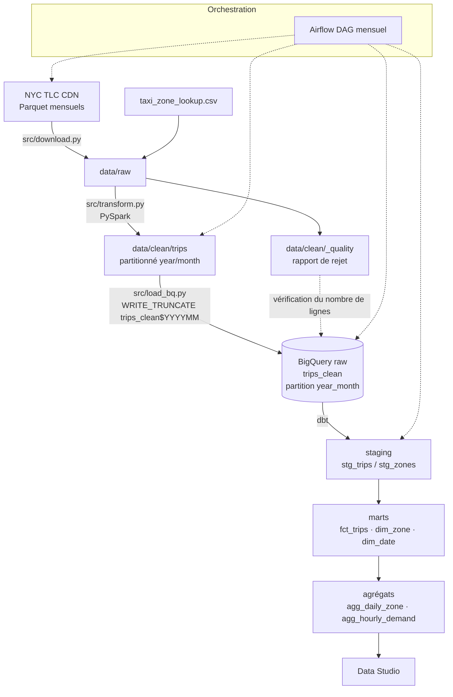
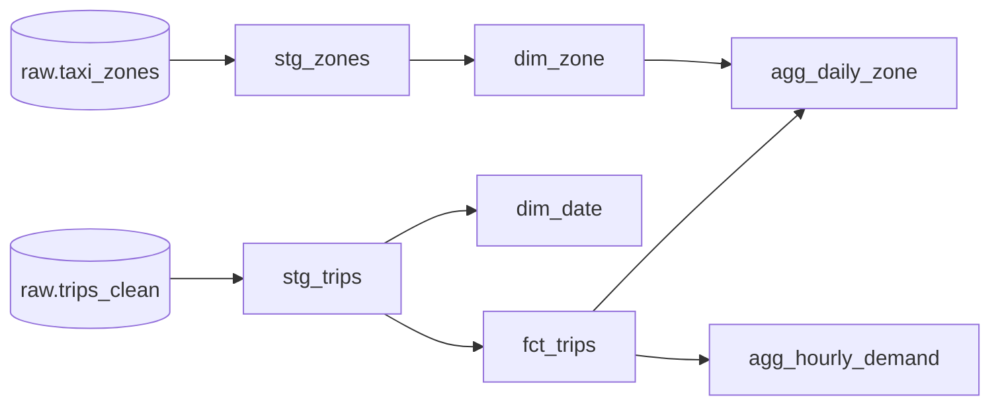

# Schéma d'architecture (Mermaid)

Rendu automatiquement par GitHub.

```mermaid
flowchart TD
    A[NYC TLC CDN<br/>Parquet mensuels] -->|src/download.py| B[data/raw]
    Z[taxi_zone_lookup.csv] --> B
    B -->|src/transform.py<br/>PySpark| C[data/clean/trips<br/>partitionné year/month]
    B --> Q[data/clean/_quality<br/>rapport de rejet]
    C -->|src/load_bq.py<br/>WRITE_TRUNCATE trips_clean$YYYYMM| D[(BigQuery raw<br/>trips_clean<br/>partition year_month)]
    Q -.->|vérification du nombre de lignes| D
    D -->|dbt| E[staging<br/>stg_trips / stg_zones]
    E --> F[marts<br/>fct_trips · dim_zone · dim_date]
    F --> G[agrégats<br/>agg_daily_zone · agg_hourly_demand]
    G --> H[Data Studio]

    subgraph Orchestration
      I[Airflow DAG mensuel]
    end
    I -.-> A
    I -.-> C
    I -.-> D
    I -.-> E
```

## Lignage dbt

```mermaid
flowchart LR
    src_trips[(raw.trips_clean)] --> stg_trips
    src_zones[(raw.taxi_zones)] --> stg_zones
    stg_zones --> dim_zone
    stg_trips --> dim_date
    stg_trips --> fct_trips
    fct_trips --> agg_daily_zone
    dim_zone --> agg_daily_zone
    fct_trips --> agg_hourly_demand
```
